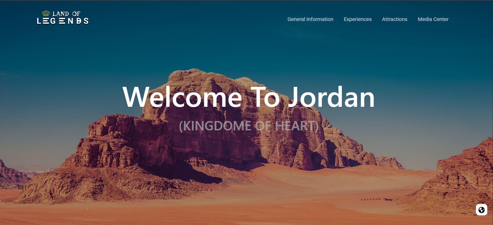
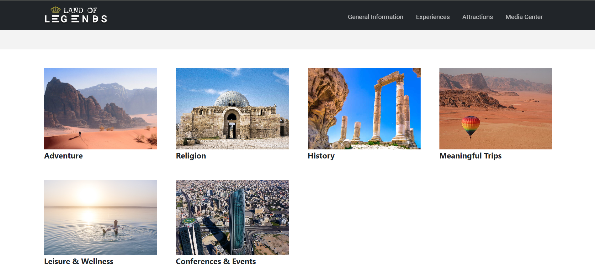
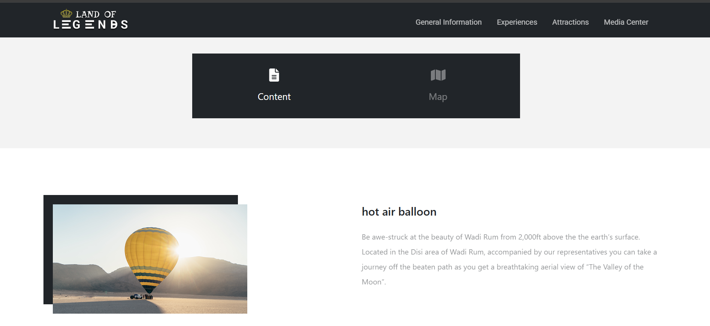

# 🏛️ Land of Legends  

**Land of Legends** is a web application designed to serve as a **digital travel guide for Jordan**.  
It provides users with comprehensive information about Jordan’s **history, cultural landmarks, natural wonders, and local experiences**.  
The platform helps tourists explore popular destinations and discover unique activities, offering an engaging and informative experience.  

---

## ✨ Features  

- 🗺️ **Tourist Information Hub** – Explore cultural, historical, and natural sites in Jordan.  
- 📖 **Detailed Destination Pages** – Each location includes photos, descriptions, and travel tips.  
- 🔍 **Search & Filter** – Quickly find destinations based on categories (historical, cultural, adventure, etc.).  
- 📱 **Responsive Design** – Optimized for desktop, tablet, and mobile screens.  
- 🌍 **Local Experiences** – Recommendations for food, activities, and events.  

---

## 🛠️ Tech Stack  

- **Frontend:** HTML, CSS, JavaScript  
- **Frameworks/Libraries:** Bootstrap, jQuery  
- **Backend:** PHP  
- **Database:** MySQL  
- **Tools:** Git, VS Code, XAMPP  

---

## 📸 Screenshots  

  




---

## 🚀 Installation & Setup  

1. **Clone the repository**  
   ```bash
   git clone https://github.com/yourusername/land-of-legends.git
   cd land-of-legends

2. **Set up the environment**

   * Install [XAMPP](https://www.apachefriends.org/) or [Laragon](https://laragon.org/).
   * Place the project folder inside the `htdocs` directory (for XAMPP).

3. **Database setup**

   * Create a new MySQL database (e.g., `land_of_legends`).
   * Import the SQL file included in the repository (`land_of_legends.sql`).
   * Update database credentials in the project config file (e.g., `config.php`).

4. **Run the project**

   * Start Apache and MySQL in XAMPP.
   * Open [http://localhost/land-of-legends](http://localhost/land-of-legends) in your browser.

---

## 🎮 Usage

* Browse available destinations.
* Search for historical sites, cultural landmarks, and activities.
* View detailed descriptions with recommendations.
* Explore travel tips for a smooth experience.

---

## 🔮 Future Improvements

* 🌐 Add multilingual support (Arabic & English).
* 📌 Integrate Google Maps for interactive navigation.
* ⭐ Allow users to rate and review destinations.
* 🧳 Add itinerary planner for customized trips.

---

## 🤝 Contributing

Contributions are welcome!
If you’d like to improve the project:

1. Fork the repository
2. Create a new branch (`feature/your-feature`)
3. Commit your changes
4. Open a Pull Request

---

## 📜 License

This project is licensed under the **MIT License** – feel free to use and modify it.

---

## 👤 Author

**Osama Fattoum**

